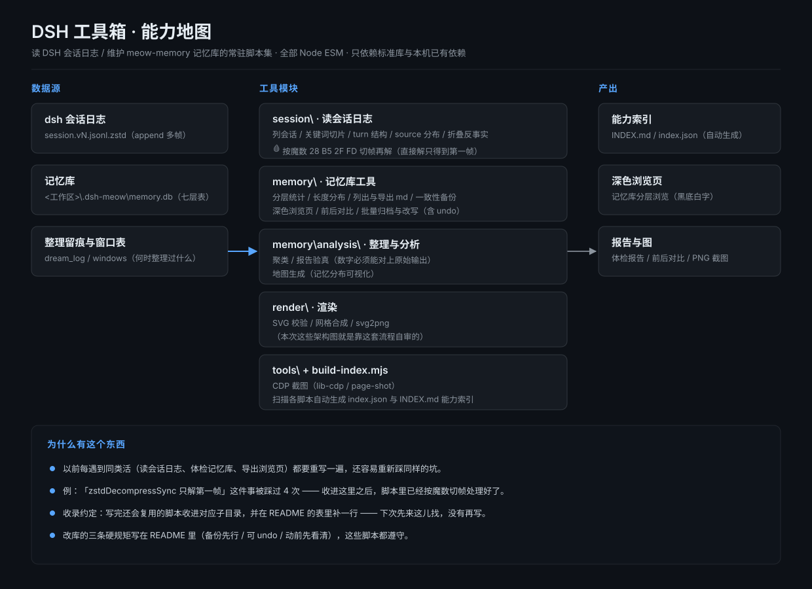
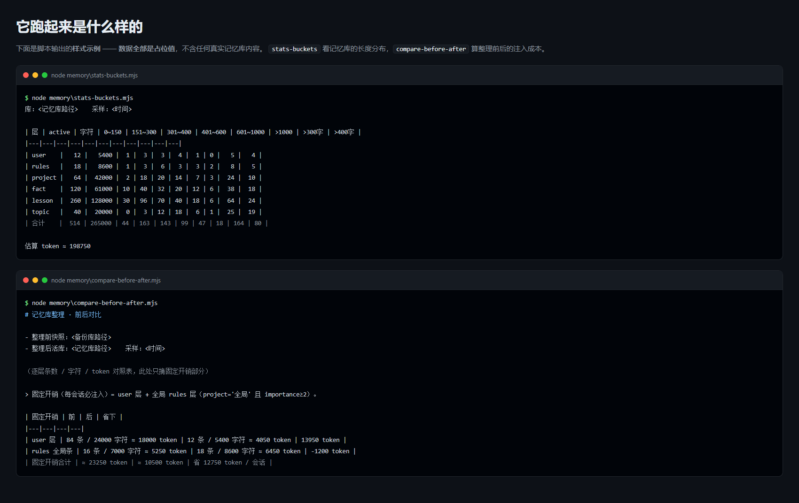

# DSH 工具箱（dsh-toolbox）/ DSH Toolbox

> **本工具由 DeepSeek（DSH agent）编写** · 仓库由 [CNyaotian](https://github.com/CNyaotian-Lunar) 维护与发布。
>
> **English:** **Written by DeepSeek (the DSH agent)** · maintained and published by [CNyaotian](https://github.com/CNyaotian-Lunar).

> 2026-09-22 建。把「写完一次、以后还会反复用」的脚本从一次性任务目录里收出来，**常驻工作区**，随手可调。
> 目录：`<工作区>\projects\dsh-toolbox\` · 全部 Node ESM（本机 Node v24）· 只依赖标准库 + 本机已有依赖。
>
> **English:** Created 2026-09-22. It takes scripts that are "written once, then reused over and over" out of throwaway task directories into a **permanent workspace toolbox**, ready to call at any time.
> Directory: `<workspace>\projects\dsh-toolbox\` · all Node ESM (Node v24 on this machine) · depends only on the standard library plus dependencies already present on this machine.





## 为什么有这个东西 / Why This Exists

以前每遇到同类活（读 dsh 会话日志、体检记忆库、导出浏览页…）都要**重写一遍**，还容易重新踩同样的坑
（例如"`zstdDecompressSync` 只解第一帧"这件事被踩过 4 次）。收到这里之后：**先来这儿找，没有再写**。

**English:** Previously, every time the same kind of job came up (reading dsh session logs, health-checking the memory DB, exporting a browser page…), it had to be **written all over again**, and the same pitfalls got re-hit (for example "`zstdDecompressSync` only decodes the first frame" was hit 4 times). After collecting them here: **look here first, only write something new if it isn't here**.

## 目录结构 / Directory Layout

目录一览：/ At a glance:

```
dsh-toolbox\
  README.md            本文件（总入口）
  build-index.mjs      扫全部脚本，生成 INDEX.md / index.json
  session\             读 / 分析 dsh 会话日志
  memory\              记忆库（meow-memory 的 memory.db）体检 · 导出 · 浏览 · 备份 · 批量改
  render\              SVG → PNG 渲染 / 多图拼版（依赖 sharp）
  tools\               其它工具（无头浏览器截图 · CDP 小客户端）
  out\                 生成物（浏览页、报告；已在 .gitignore 里）
```

**English:** What each directory is for:
- `session\` — read / analyse dsh session logs
- `memory\` — health-check · export · browse · back up · bulk-edit the memory DB (meow-memory's `memory.db`)
- `render\` — SVG → PNG rendering and grid composition (needs `sharp`)
- `tools\` — other tools (headless browser screenshots, a tiny CDP client)
- `out\` — generated artefacts (browser pages, reports; ignored by git)

## ① `session\` —— 读 dsh 会话日志 / ① `session\` — Reading dsh Session Logs

会话文件是 `~/.dsh/sessions/<workspace>/<id>/session.v<N>.jsonl.zstd`（`N` 随版本递增，脚本按 `session.v*.jsonl.zstd` 通配匹配，不写死版本号）。
🩸 **它是 append 的多帧 zstd**：`zstdDecompressSync` 只解第一帧（只得到 ~192 字节的会话头或直接报
`Unknown frame descriptor`）—— 下面这些脚本都已经按魔数 `28 B5 2F FD` **切帧再逐帧解**，直接用就行。

**English:** Session files live at `~/.dsh/sessions/<workspace>/<id>/session.v<N>.jsonl.zstd` (`N` grows with the format version; the scripts match `session.v*.jsonl.zstd` rather than hard-coding a version).
🩸 **They are append-only multi-frame zstd**: `zstdDecompressSync` decodes only the first frame (yielding either the ~192-byte session header or a straight `Unknown frame descriptor` error) — the scripts below already **split frames on the magic number `28 B5 2F FD` and decode them one by one**, so just use them as they are.

| 脚本 | 干什么 | 例子 |
|---|---|---|
| `list-sessions.mjs` | 列全部会话：id / 标题 / 末条用户消息（可按关键词过滤） | `node session\list-sessions.mjs a2a` |
| `zstd-session.mjs` | 解压一个会话，按关键词切片打印（前后若干行） | `node session\zstd-session.mjs <文件> "关键词" 1 200` |
| `dump-session.mjs` | 同上（按关键词切片打印），与 `zstd-session.mjs` 为同一实现的另一入口 | `node session\dump-session.mjs <文件> "关键词" 3 400` |
| `dump-turn.mjs` | 打印某会话**某个 turn** 的节点序列（step / kind / 工具名） | `node session\dump-turn.mjs 0c11dcbf 17` |
| `turn-summary.mjs` | 某会话**最后 N 个 turn** 的结构摘要（步数/工具数/文本数/是否含 meow prompt） | `node session\turn-summary.mjs 0c11dcbf 4` |
| `scan-sources.mjs` | 全库统计 `user/message.source.kind` 分布 | `node session\scan-sources.mjs <会话根>` |
| `sample-sources.mjs` | 每种 source 抽一条样例文本（判断这类注入是什么） | `node session\sample-sources.mjs <会话根>` |
| `repro-inbound.mjs` | **折叠范围反事实复现**：事件流 → chat 快照 → 对比修复前后折叠组 | `node session\repro-inbound.mjs --fold-src <目录> 0c11dcbf` |
| `_repro-inbound.mjs` | 与 `repro-inbound.mjs` **逐字节相同**的历史副本（留给旧调用，内容随前者同步） | `node session\_repro-inbound.mjs --fold-src <目录> 0c11dcbf` |

> ⚠️ `repro-inbound.mjs` 需要一个**本仓库之外**的目录 `--fold-src`：里面要有 dsh 客户端的
> `client-fold-baseline.ts`（修复前）与 `client-fold-fixed.ts`（修复后）。缺了会直接报错退出。

**English:**

| Script | What it does | Example |
|---|---|---|
| `list-sessions.mjs` | list every session: id / title / last message from the user (keyword filter supported) | `node session\list-sessions.mjs a2a` |
| `zstd-session.mjs` | decompress one session and print slices around a keyword (a few lines either side) | `node session\zstd-session.mjs <文件> "关键词" 1 200` |
| `dump-session.mjs` | same slicing printer as `zstd-session.mjs`, exposed under a second entry point | `node session\dump-session.mjs <文件> "关键词" 3 400` |
| `dump-turn.mjs` | print the node sequence of **one turn** of a session (step / kind / tool name) | `node session\dump-turn.mjs 0c11dcbf 17` |
| `turn-summary.mjs` | structural summary of a session's **last N turns** (steps / tools / texts / whether a meow prompt is present) | `node session\turn-summary.mjs 0c11dcbf 4` |
| `scan-sources.mjs` | tally the `user/message.source.kind` distribution across the whole store | `node session\scan-sources.mjs <sessions-root>` |
| `sample-sources.mjs` | pull one sample text per source kind (to tell what that kind of injection is) | `node session\sample-sources.mjs <sessions-root>` |
| `repro-inbound.mjs` | **folding-range counterfactual reproduction**: event stream → chat snapshot → compare folding groups before/after the fix | `node session\repro-inbound.mjs --fold-src <dir> 0c11dcbf` |
| `_repro-inbound.mjs` | a **byte-identical** historical copy of `repro-inbound.mjs` (kept for old call sites; kept in sync with it) | `node session\_repro-inbound.mjs --fold-src <dir> 0c11dcbf` |

> ⚠️ `repro-inbound.mjs` needs a directory **outside this repo** via `--fold-src`: it must contain the dsh
> client's `client-fold-baseline.ts` (before the fix) and `client-fold-fixed.ts` (after the fix). Without it the script exits with an error.

> ⚠️ 会话**目录名不都有 `session-` 前缀**（子代理会话是裸 UUID）—— 按前缀过滤会漏掉大半（实测 123 → 24）。
>
> **English:** ⚠️ Session **directory names do not all carry a `session-` prefix** (subagent sessions are bare UUIDs) — filtering by prefix misses most of them (measured: 123 → 24).

## ② `memory\` —— 记忆库（`<工作区>\.dsh-meow\memory.db`）/ ② `memory\` — The Memory DB (`<workspace>\.dsh-meow\memory.db`)

> ⚠️ **库路径有两种口径，别混**：
> - **支持 `--db <路径>` 的脚本**：`apply-archive` / `apply-compress` / `apply-merge` / `archive-user-old` / `mem-archive` / `mem-cut` / `merge-keywords` / `restore-compress` / `restore-merge` —— 解析顺序 `--db` → 环境变量 `DSH_MEMORY_DB` → `<DSH_WORKSPACE 或用户主目录>\.dsh-meow\memory.db`。
> - **其余脚本**：库路径要么走**位置参数**（`memory-stats` / `stats-buckets` / `analyze` / `gen-browser` 的 `argv[2]`；`backup-db` / `export-from-backup` / `compare-before-after` 的库路径参数），要么**只认环境变量** `DSH_MEMORY_DB`（`list-lite` / `list-user` / `mem-dist` / `export-layer` / `verify-merge-json` / `verify-compress-json` / `token-account`）—— 给它们传 `--db` 会被**静默忽略**、落到默认库（`filter-merge-json` / `normalize-members` 根本不读库）。
>
> 生成物（报告 / undo）默认写本仓库的 `out\`，可用 `DSH_TOOLBOX_OUT` 覆盖。
>
> **English:** ⚠️ **Two DB-path conventions — do not mix them up**:
> - **Scripts that take `--db <path>`**: `apply-archive` / `apply-compress` / `apply-merge` / `archive-user-old` / `mem-archive` / `mem-cut` / `merge-keywords` / `restore-compress` / `restore-merge` — resolution order `--db` → `DSH_MEMORY_DB` → `<DSH_WORKSPACE or home>\.dsh-meow\memory.db`.
> - **All other scripts**: the DB path is either a **positional argument** (`argv[2]` in `memory-stats` / `stats-buckets` / `analyze` / `gen-browser`; the DB-path arguments of `backup-db` / `export-from-backup` / `compare-before-after`) or **only the `DSH_MEMORY_DB` environment variable** (`list-lite` / `list-user` / `mem-dist` / `export-layer` / `verify-merge-json` / `verify-compress-json` / `token-account`) — passing `--db` to those is **silently ignored** and the default DB is used (`filter-merge-json` / `normalize-members` do not read the DB at all).
> Generated artefacts (reports / undo files) default to this repo's `out\`, overridable via `DSH_TOOLBOX_OUT`.

| 脚本 | 干什么 | 例子 |
|---|---|---|
| `memory-stats.mjs` | 分层条数 / 状态分布 / project 子类 / 各层最近若干条 | `node memory\memory-stats.mjs` |
| `stats-buckets.mjs` | 各层**长度分布桶**（>300 / >400 字有多少） | `node memory\stats-buckets.mjs` |
| `list-lite.mjs` | 列某层 active 条目（id / project / 长度 / 首 64 字），按长度倒序 | `node memory\list-lite.mjs lesson` |
| `list-user.mjs` | 专列 user 层（每会话固定注入的那层），带过滤 | `node memory\list-user.mjs "极简"` |
| `export-layer.mjs` | 某层 active 全文导出成 md | `node memory\export-layer.mjs lesson out\lesson.md` |
| `export-from-backup.mjs` | 从**备份库**导出某层（补"整理前"快照用） | `node memory\export-from-backup.mjs <bak> rules out\rules-before.md` |
| `backup-db.mjs` | **一致性备份**（`VACUUM INTO`，含 WAL 未落盘数据，源库不改） | `node memory\backup-db.mjs <源db> <目标>` |
| `gen-browser.mjs` | 全库导出**单文件深色浏览页**（搜索/筛选/展开） | `node memory\gen-browser.mjs` → `out\memory-browser.html` |
| `compare-before-after.mjs` | **前后对比报告**（逐层条数/字符/token + 固定开销） | `node memory\compare-before-after.mjs` |
| `apply-archive.mjs` | 批量归档（早期专用版：只认 active） | `node memory\apply-archive.mjs --cluster C1,C2 --apply` |
| `mem-archive.mjs` | **通用归档器（推荐）**：`--table` 任意层、`--ids`/`--from-file`/`--cluster`、`--from <states>`（**可归档 stale**）、undo **按原状态还原**、id 抄错时给近似提示 | `node memory\mem-archive.mjs --table topic --from stale --ids <ids> --apply` |
| `mem-cut.mjs` | **判据裁剪**：`low-imp` / `never` / `never+low(+old)` / `never+verylow(+old)`；默认**按长度从长到短**砍，可 `--limit` | `node memory\mem-cut.mjs --table lesson --rule never+verylow+old --olderThanDays 3` |
| `apply-compress.mjs` | 批量**改写正文**（任意层；逐条校验状态/长度/**必须真变短**；旧正文全量存 undo JSON，**文件名带表名+时间戳不覆盖**） | `node memory\apply-compress.mjs out\x.json --table fact --apply` |
| `apply-merge.mjs` | **簇内合并落地**：把成员并进**主条**（改写主条正文 + 归档其余成员，可同时改 keywords/project/importance）；判据是「比**簇内原总和**短」 | `node memory\apply-merge.mjs out\merge-fact-C1-C2.json --table fact --apply` |
| `restore-merge.mjs` | 上面那个的**还原器**（主条四字段 + 该批归档的成员一起还原回 active） | `node memory\restore-merge.mjs out\undo-merge-fact-<戳>.json --table fact --apply` |
| `verify-merge-json.mjs` | **合并产物独立验真**（不信子代理自检）：从库重读原文算实体覆盖率 + 校验 id/状态/长度/膨胀；`--dump` 落盘正文 | `node memory\verify-merge-json.mjs out\merge-fact-C1-C2.json --table fact --dump C1` |
| `merge-keywords.mjs` | **合并后补关键词并集**（keywords 不进首轮注入、只作检索入口 ⇒ 丢词=丢命中）；自动滤掉 `ttl 900` 类过时值与「已修」类过程词 | `node memory\merge-keywords.mjs out\merge-fact-C1-C2.json --table fact --max 16` |
| `filter-merge-json.mjs` | 按 cluster 名**过滤 merge JSON**（剔除某些簇后另存） | `node memory\filter-merge-json.mjs in.json out.json --exclude "C1,C2"` |
| `restore-compress.mjs` | 上面那个的**还原器**（支持 `--table`，能按 undo 文件名猜表） | `node memory\restore-compress.mjs out\undo-compress-fact-2026092300.json --apply` |
| `archive-user-old.mjs` | user 层整批归档（保留 12 条主题条，其余全归档 + undo） | `node memory\archive-user-old.mjs --apply` |
| `analyze.mjs` | 体检：层分布 / 注入成本 / 重复簇 / 超长 / 关键词 / 时间分布 | `node memory\analyze.mjs` |
| `verify-compress-json.mjs` | **压缩产物独立验真**：原文实体的覆盖率 + 反向核对「凭空新增的事实」；`--dump` 落盘正文 | `node memory\verify-compress-json.mjs out\x.json --table topic --dump C1` |
| `mem-dist.mjs` | 只读看各层 importance / 长度 / 是否被检索命中过 / 项目的分布（砍之前先看清代价） | `node memory\mem-dist.mjs lesson` |
| `normalize-members.mjs` | 把 merge JSON 的 `members` 从对象数组规范化成 id 字符串数组，并校验没有丢 id | `node memory\normalize-members.mjs in.json out.json` |
| `token-account.mjs` | 「每轮固定注入」总账：两份 AGENTS.md 与记忆库整理前后的 token 一起算 | `node memory\token-account.mjs --agents-before <旧版> --db-before <旧备份库>` |

**English:**

| Script | What it does | Example |
|---|---|---|
| `memory-stats.mjs` | per-level counts / status distribution / project subcategories / the latest few entries per level | `node memory\memory-stats.mjs` |
| `stats-buckets.mjs` | **length-distribution buckets** per level (how many are >300 / >400 chars) | `node memory\stats-buckets.mjs` |
| `list-lite.mjs` | list active entries of one level (id / project / length / first 64 chars), longest first | `node memory\list-lite.mjs lesson` |
| `list-user.mjs` | lists only the user level (the one injected into every session), with filtering | `node memory\list-user.mjs "极简"` |
| `export-layer.mjs` | export one level's active entries in full to md | `node memory\export-layer.mjs lesson out\lesson.md` |
| `export-from-backup.mjs` | export one level from a **backup DB** (to fill in a "before the tidy-up" snapshot) | `node memory\export-from-backup.mjs <bak> rules out\rules-before.md` |
| `backup-db.mjs` | **consistent backup** (`VACUUM INTO`, includes WAL data not yet flushed, source DB untouched) | `node memory\backup-db.mjs <源db> <目标>` |
| `gen-browser.mjs` | export the whole DB as a **single-file dark browser page** (search / filter / expand) | `node memory\gen-browser.mjs` → `out\memory-browser.html` |
| `compare-before-after.mjs` | **before/after comparison report** (per-level counts / chars / tokens + fixed overhead) | `node memory\compare-before-after.mjs` |
| `apply-archive.mjs` | bulk archive (the early special-purpose version: only recognises active) | `node memory\apply-archive.mjs --cluster C1,C2 --apply` |
| `mem-archive.mjs` | **general-purpose archiver (recommended)**: `--table` any level, `--ids`/`--from-file`/`--cluster`, `--from <states>` (**can archive stale**), undo that **restores each entry's original state**, and near-match hints when an id is mistyped | `node memory\mem-archive.mjs --table topic --from stale --ids <ids> --apply` |
| `mem-cut.mjs` | **rule-based trimming**: `low-imp` / `never` / `never+low(+old)` / `never+verylow(+old)`; by default it cuts **from longest to shortest**, with `--limit` | `node memory\mem-cut.mjs --table lesson --rule never+verylow+old --olderThanDays 3` |
| `apply-compress.mjs` | bulk **body rewriting** (any level; per-entry validation of state/length/**must genuinely get shorter**; all old bodies are stored in an undo JSON whose **filename carries the table name + timestamp so nothing is overwritten**) | `node memory\apply-compress.mjs out\x.json --table fact --apply` |
| `apply-merge.mjs` | **landing an intra-cluster merge**: folds members into the **primary entry** (rewrites its body + archives the remaining members, and can change keywords/project/importance at the same time); the criterion is "shorter than the **original cluster total**" | `node memory\apply-merge.mjs out\merge-fact-C1-C2.json --table fact --apply` |
| `restore-merge.mjs` | the **restorer** for the above (restores the primary entry's four fields plus that batch's archived members back to active together) | `node memory\restore-merge.mjs out\undo-merge-fact-<戳>.json --table fact --apply` |
| `verify-merge-json.mjs` | **independent verification of merge output** (it does not trust the subagent's self-check): re-reads the original text from the DB to compute entity coverage + validates ids/state/length/bloat; `--dump` writes the bodies to disk | `node memory\verify-merge-json.mjs out\merge-fact-C1-C2.json --table fact --dump C1` |
| `merge-keywords.mjs` | **backfills the union of keywords after a merge** (keywords are not injected in the first round, they are only search entry points ⇒ losing a word = losing a hit); automatically filters out stale values such as `ttl 900` and process words such as "已修" | `node memory\merge-keywords.mjs out\merge-fact-C1-C2.json --table fact --max 16` |
| `filter-merge-json.mjs` | **filter a merge JSON** by cluster name (save the rest after dropping certain clusters) | `node memory\filter-merge-json.mjs in.json out.json --exclude "C1,C2"` |
| `restore-compress.mjs` | the **restorer** for the above (supports `--table`, and can infer the table from the undo filename) | `node memory\restore-compress.mjs out\undo-compress-fact-2026092300.json --apply` |
| `archive-user-old.mjs` | bulk-archive the user level (keeps 12 topic entries, archives all the rest + undo) | `node memory\archive-user-old.mjs --apply` |
| `analyze.mjs` | health check: level distribution / injection cost / duplicate clusters / over-long entries / keywords / time distribution | `node memory\analyze.mjs` |
| `verify-compress-json.mjs` | **independent verification of compression output**: entity coverage of the original text plus a reverse check for "facts invented out of nowhere"; `--dump` writes the bodies to disk | `node memory\verify-compress-json.mjs out\x.json --table topic --dump C1` |
| `mem-dist.mjs` | read-only view of each level's importance / length / never-retrieved / project distribution (see the cost before you cut) | `node memory\mem-dist.mjs lesson` |
| `normalize-members.mjs` | normalises a merge JSON's `members` from an object array into an id string array, verifying no id was dropped | `node memory\normalize-members.mjs in.json out.json` |
| `token-account.mjs` | the "fixed per-round injection" ledger: both AGENTS.md files and the memory DB before/after a tidy-up, added up together | `node memory\token-account.mjs --agents-before <old> --db-before <old-backup>` |

### 改库的三条硬规矩（这些脚本都遵守）/ Three Hard Rules for Mutating the DB (all these scripts follow them)
1. **先备份**：`backup-db.mjs`（`VACUUM INTO` 到 `<工作区>\backups\meow-memory\`）。
   **English:** **Back up first**: `backup-db.mjs` (`VACUUM INTO` into `<workspace>\backups\meow-memory\`).
2. **先 dry-run**：`apply-archive` / `apply-compress` 不加 `--apply` 就只打印清单。
   **English:** **Dry-run first**: `apply-archive` / `apply-compress` only print the list unless `--apply` is passed.
3. **留 undo**：归档写 `out\undo-archive-<表>.sql`（**按原状态还原**）；改正文写 `out\undo-compress-<表>-<时间戳>.json`（配 `restore-compress.mjs`，**不再覆盖上一批**）；合并写 `out\undo-merge-<表>.json` + 同批 archive SQL。
   **English:** **Always leave an undo**: archiving writes `out\undo-archive-<table>.sql` (**restoring each entry's original state**); body rewrites write `out\undo-compress-<table>-<timestamp>.json` (paired with `restore-compress.mjs`, and it **no longer overwrites the previous batch**); merges write `out\undo-merge-<table>.json` plus the archive SQL for the same batch.

## ③ `render\` —— SVG 渲染与拼版 / ③ `render\` — SVG Rendering & Grid Composition

⚠️ 这一组依赖 [`sharp`](https://sharp.pixelplumbing.com/)（**不是标准库**）：在仓库根 `npm i sharp` 即可；
sharp 若装在别处，用环境变量 `DSH_SHARP_DIR` 指过去（脚本也会从自身目录向上逐级找 `node_modules/sharp`）。
**English:** ⚠️ This group depends on [`sharp`](https://sharp.pixelplumbing.com/) (**not** the standard library): run `npm i sharp` in the repo root; if sharp lives elsewhere, point `DSH_SHARP_DIR` at it (the scripts also walk up from their own directory looking for `node_modules/sharp`).

| 脚本 | 干什么 | 例子 |
|---|---|---|
| `svg2png.mjs` | 把静态 SVG 转 PNG（sharp/librsvg，**不用浏览器**）；命中哪个 sharp 会打印出来 | `node render\svg2png.mjs in.svg out.png 144` |
| `compose-grid.mjs` | 多张 SVG / PNG 按网格拼成一张对比图，每格顶部加文件名标签 | `node render\compose-grid.mjs out.png 2 900 a.png b.svg` |
| `check-svg.mjs` | 校验导出的静态 SVG：自包含性 / XML 良构 / UTF-8 / 中文标签 / 与线上产物一致性 | `node render\check-svg.mjs map.html spider.svg force.svg` |

**English:**

| Script | What it does | Example |
|---|---|---|
| `svg2png.mjs` | convert a static SVG to PNG (sharp/librsvg, **no browser**); prints which sharp it found | `node render\svg2png.mjs in.svg out.png 144` |
| `compose-grid.mjs` | compose several SVG / PNG files into one grid image, with a filename label above each cell | `node render\compose-grid.mjs out.png 2 900 a.png b.svg` |
| `check-svg.mjs` | validate an exported static SVG: self-containment / XML well-formedness / UTF-8 / Chinese labels / agreement with the online artefact | `node render\check-svg.mjs map.html spider.svg force.svg` |

## ④ `tools\` —— 其它工具 / ④ `tools\` — Other Tools

| 脚本 | 干什么 | 例子 |
|---|---|---|
| `page-shot.mjs` | 无头浏览器「截图 + 采集 console 错误 + 跑断言」；用独立的 user-data-dir 与端口 ⇒ 不弹窗、不抢焦点 | `node tools\page-shot.mjs --url file:///…/x.html --out shot.png --full` |
| `lib-cdp.mjs` | 极简 CDP 客户端（Node ≥22 自带全局 WebSocket，无依赖），供 `page-shot.mjs` 复用 | 库，用法见文件头注释 |

**English:**

| Script | What it does | Example |
|---|---|---|
| `page-shot.mjs` | headless browser "screenshot + collect console errors + run assertions"; uses its own user-data-dir and port ⇒ no window, no focus stealing | `node tools\page-shot.mjs --url file:///…/x.html --out shot.png --full` |
| `lib-cdp.mjs` | a minimal CDP client (Node ≥22 ships a global WebSocket; no dependencies), reused by `page-shot.mjs` | a library — see the file header |

## ⑤ 仓库根：索引生成器 / ⑤ Repo Root: Index Generator

| 脚本 | 干什么 | 例子 |
|---|---|---|
| `build-index.mjs` | 扫本仓库所有脚本，抽出顶部注释里的「干什么 / 用法」，生成 `INDEX.md`（人看）与 `index.json`（机器读） | `node build-index.mjs` |

> 加了新脚本**重跑一次**就行 —— 两份索引会自动更新，**别手改**它们。
>
> **English:**
> | Script | What it does | Example |
> |---|---|---|
> | `build-index.mjs` | scans every script in the repo, pulls the "what it does / usage" out of the top comment, and writes `INDEX.md` (for humans) and `index.json` (for machines) | `node build-index.mjs` |
>
> After adding a script, **just re-run it** — both index files update themselves; **don't hand-edit** them.

## 收录约定（以后往这儿加东西时照做）/ Inclusion Rules (follow these when adding things here later)

1. **只收"会被反复调用"的**：标准库依赖、参数化路径、幂等、`--apply` 与 dry-run 分开。
   **English:** **Only collect things that will be called repeatedly**: standard-library-only dependencies, parameterised paths, idempotency, and `--apply` kept separate from dry-run.
2. **改库/删文件的脚本必须自带 undo**（写 undo 文件 + 提供还原脚本）。
   **English:** **Scripts that mutate the DB or delete files must ship their own undo** (write an undo file + provide a restore script).
3. **每个脚本顶部写清**：它解决什么问题、怎么用、最容易踩的坑。
   **English:** **Write it clearly at the top of every script**: what problem it solves, how to use it, and the easiest pitfall to fall into.
4. 新加脚本后**在本 README 的对应表里补一行**（表就是索引，别让它烂掉）。
   **English:** After adding a script, **add a row to the matching table in this README** (the tables are the index — don't let them rot).
5. 原任务目录里的版本**不要删**（那是带上下文的存档），这里的是"正式可复用版"。
   **English:** **Do not delete** the copy in the original task directory (that is an archive with its context); the one here is the "official reusable version".

## 运行环境 / Requirements

- **Node.js ≥ 20**（主体）；其中用 CDP 的脚本（`tools\page-shot.mjs` 等，经 `lib-cdp.mjs`）**需要 Node ≥ 22**，因为它依赖 Node 22 起自带的全局 `WebSocket`。本机在 **Node 24** 上实测通过。
- **Python 3**（仅当你使用个别 Python 辅助脚本）。
- **运行依赖：无**。所有 `.mjs` 都是零第三方依赖的纯 Node 脚本；可选能力（`sharp` 渲染、Edge/CDP 截图）按需探测，缺了就跳过并给出提示。
- **本仓不是 DSH 插件**（没有 `cordis.patch.yml`），只是一组可直接 `node xxx.mjs` 运行的工具脚本。

**English:**
- **Node.js ≥ 20** (the bulk); scripts that use CDP (`tools\page-shot.mjs` and friends, via `lib-cdp.mjs`) **need Node ≥ 22** because they rely on the global `WebSocket` shipped since Node 22. Verified on **Node 24** here.
- **Python 3** (only for a couple of optional helper scripts).
- **Runtime dependencies: none.** Every `.mjs` is a plain Node script with zero third-party dependencies; optional capabilities (`sharp` rendering, Edge/CDP screenshots) are probed at runtime and skipped with a message when absent.
- **This repo is not a DSH plugin** (no `cordis.patch.yml`) — it is a set of scripts you run directly with `node xxx.mjs`.

## 权限与依赖 / Permissions & Dependencies

> 按「保守」口径声明本工具集对系统的接触面 —— **「未发现」不等于「不访问」**。
>
> **English:** The following declares, conservatively, what this toolbox touches on a system — **"not observed" does not mean "does not access"**.

- **文件 / Files**
  - 读：记忆库 `--db` / `DSH_MEMORY_DB` / `<DSH_WORKSPACE 或用户主目录>\.dsh-meow\memory.db`；会话日志 `DSH_SESSIONS_DIR` / `<DSH_HOME 或 ~/.dsh>\sessions`；`--fold-src` 指定的目录。
  - 写：默认只写本仓库的 `out\`（可用 `DSH_TOOLBOX_OUT` 覆盖）；`apply-*` / `mem-archive` / `mem-cut` / `merge-keywords` / `archive-user-old` 会**直接改 SQLite 记忆库**（都带 `--apply` 开关与 undo）。
  - **English:** Reads the memory DB (`--db` / `DSH_MEMORY_DB` / `<DSH_WORKSPACE or home>\.dsh-meow\memory.db`), session logs (`DSH_SESSIONS_DIR` / `<DSH_HOME or ~/.dsh>\sessions`) and the directory given by `--fold-src`. Writes by default only to this repo's `out\` (`DSH_TOOLBOX_OUT` overrides); the `apply-*` / `mem-archive` / `mem-cut` / `merge-keywords` / `archive-user-old` scripts **mutate the SQLite memory DB directly** (all gated behind `--apply` and all ship an undo).
- **网络 / Network** —— 默认**不发起任何出网请求**。唯一会联网的是 `tools\page-shot.mjs`：它连的是自己拉起的浏览器在本机 `http://127.0.0.1:<port>` 的 CDP 端点；`--url` 若指向外部站点，则由浏览器去访问那个站点（取决于使用者的参数）。
  **English:** No outbound requests by default. The only networked piece is `tools\page-shot.mjs`, which talks to the CDP endpoint at `http://127.0.0.1:<port>` of the browser it starts itself; if `--url` points at an external site, the browser will visit it (that is the caller's choice).
- **外部命令 / External commands** —— `tools\page-shot.mjs` 会启动本机 Edge/Chrome（路径可用 `DSH_BROWSER` 指定），并用 `taskkill /PID <pid> /T /F` 收掉它拉起的进程树。**不需要 root / 管理员权限**；没有安装 / 卸载等生命周期脚本。
  **English:** `tools\page-shot.mjs` starts a local Edge/Chrome (path overridable via `DSH_BROWSER`) and uses `taskkill /PID <pid> /T /F` to reap the process tree it spawned. **No root/admin rights are needed**, and there are no install/uninstall lifecycle scripts.
- **凭据 / Credentials** —— **未发现**读取任何凭据、token、密码或密钥文件；`render\` 需要的是可选的第三方依赖 `sharp`。
  **English:** **No** credential, token, password or key file was observed being read; `render\` needs the optional third-party dependency `sharp`.
- **已知风险 / Known risks** —— ① 上面那几个改库脚本**没有二次确认**，`--apply` 一给就写；虽然都写 undo，仍**务必先备份**（`memory\backup-db.mjs`）。② `page-shot.mjs --keep` 会把临时浏览器 profile 留在系统临时目录。③ `node:sqlite` 需要 Node ≥ 22。
  **English:** ① The DB-mutating scripts above have **no second confirmation** — passing `--apply` writes immediately; all of them write an undo file, but **back up first** (`memory\backup-db.mjs`). ② `page-shot.mjs --keep` leaves the temporary browser profile behind in the system temp directory. ③ `node:sqlite` requires Node ≥ 22.

## 已知待办 / Known TODO

- [x] 脚本的**默认输出路径**已统一到本仓库的 `out\`（可用 `DSH_TOOLBOX_OUT` 覆盖）；
      库 / 会话路径改为 `--db` 与环境变量（`DSH_MEMORY_DB` / `DSH_SESSIONS_DIR` / `DSH_SHARP_DIR`），不再写死任何绝对路径。
      **English:** Default output paths are now unified to this repo's `out\` (`DSH_TOOLBOX_OUT` overrides); DB / session paths go through `--db` and environment variables (`DSH_MEMORY_DB` / `DSH_SESSIONS_DIR` / `DSH_SHARP_DIR`) — no absolute paths are hard-coded any more.
- [ ] 还没有一个统一入口（`node dsh-toolbox\<子命令>`）；目前按表直接调具体脚本。
      **English:** There is no single entry point yet (`node dsh-toolbox\<subcommand>`); for now you call the specific script straight from the table.
